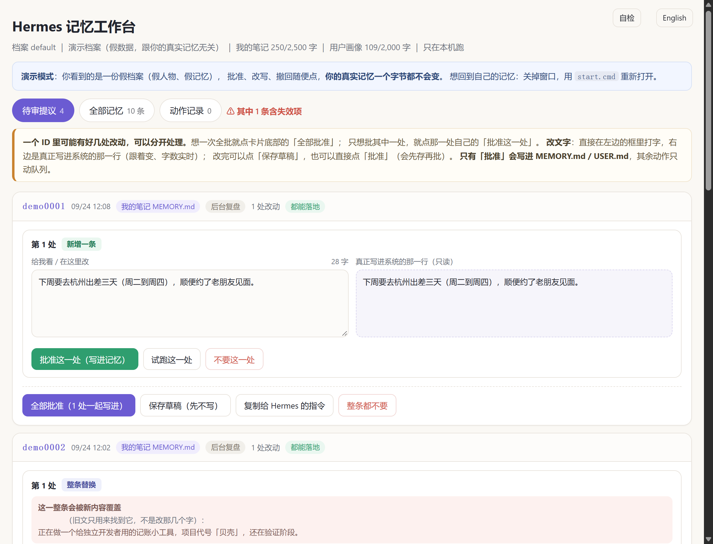
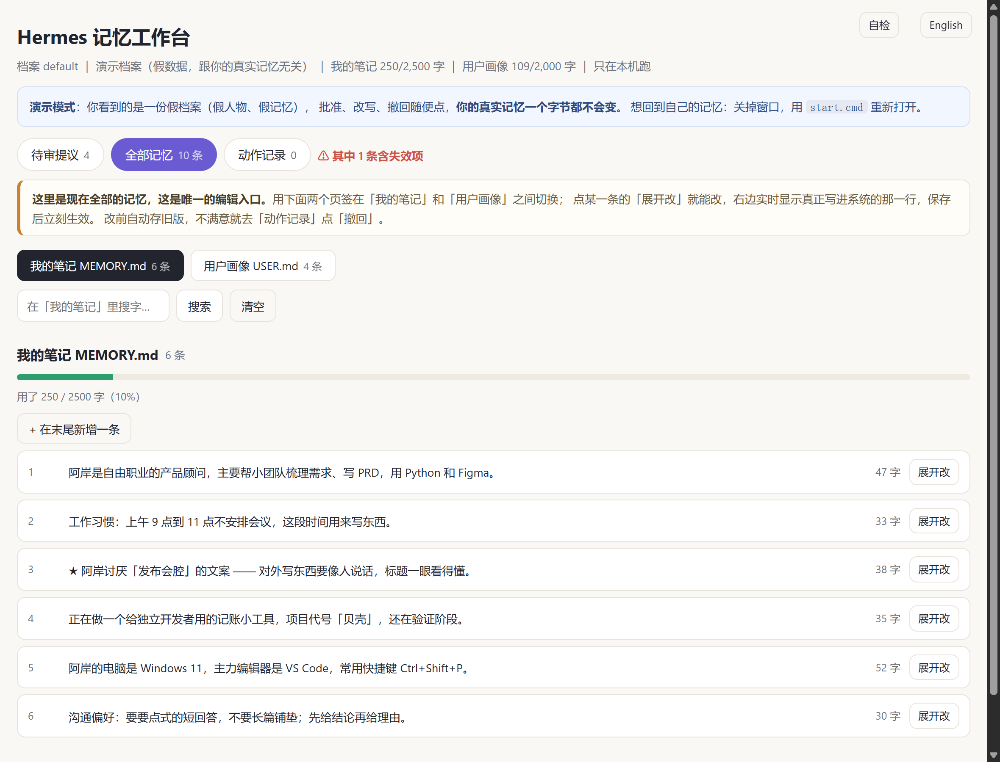
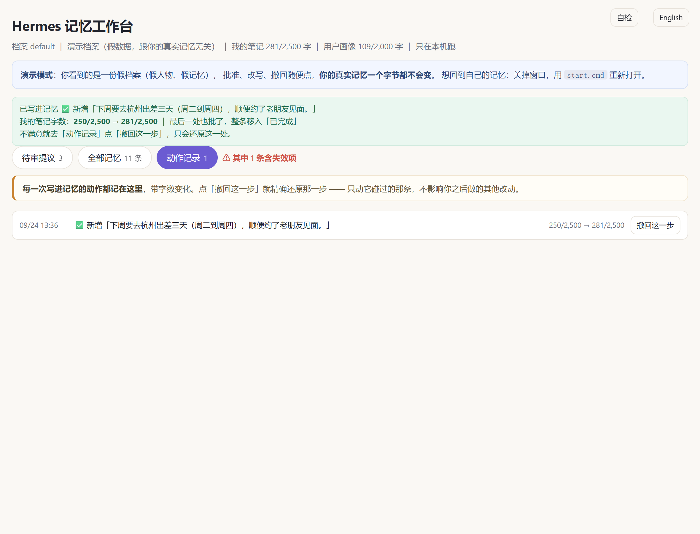

# Hermes 记忆工作台（hermes-memory-workbench）

[English](README.en.md) | **中文**

**给 Hermes 的记忆做「看 · 改 · 批 · 撤」的本地小页面。**

Hermes 有一个「改记忆前先问过我」的开关（`memory.write_approval`）。打开它之后，AI 想增删改
你的长期记忆时，会先排进一个待审队列等你点头 —— 问题是，原生只给你两个按钮：批准 / 驳回。
**这条记忆到底写了什么？想改几个字行不行？批错了能撤回吗？** 这个工具就是补这一块。

- 打开就是**本地网页**，双击脚本就来，不装东西、不常驻、不联网
- **一个字都不用自己拼**：所有写入都走 Hermes 自己的落库通道（等同 `/memory approve <id>`）
- 看得见原文、能改文字、能只批其中一处、能反悔撤回
- 删掉文件夹它就没了，Hermes 一切照旧

> 只针对 Hermes 用户。它读的是 Hermes 的**内置记忆**（`MEMORY.md` / `USER.md`），
> 不是外挂的记忆服务（mem0、Supermemory 那类）。

---

## 它长什么样

| 待审提议（主界面） | 全部记忆（唯一编辑入口） |
|---|---|
|  |  |

| 动作记录（每一步都能撤回） |
|---|
|  |

---

## 30 秒上手

前提：本机装了 **Hermes** + **Python 3.9 以上**（不需要装任何 Python 包）。

1. 打开 Hermes 的「改记忆前先问过我」：

   ```
   hermes -p default config set memory.write_approval true
   ```

   （`default` 换成你想管的那份档案名；不加 `-p` 改的是当前激活档案 —— 这是个常踩的坑）

2. 双击 `start.cmd`（Windows）或 `./start.sh`（mac / Linux）。浏览器会自动打开 `http://127.0.0.1:8787/`。

3. 让 Hermes 记住一件事（比如「记住我对花生过敏」），回到页面刷新 —— 队列里就出现一条待审提议。

**想先看它长什么样？用演示档案**（一整套假数据，碰不到你的真实记忆）：

```
start.cmd --demo        （Windows）
./start.sh --demo       （mac / Linux）
python server.py --demo （通用）
```

---

## 中英双语

页面右上角可以切 **中文 ⇄ English**；第一次打开时跟着浏览器语言走，选过之后记住你的选择。

- **界面**（标题、提示、按钮、报错、命令行输出）都有英文；**你自己的记忆内容永远原样显示、不翻译**。
- 演示档案也备了两套：中文假人设「阿岸」、英文 **Alex** —— 用 `--demo` 起，语言跟着系统走。
- 有个机械验收脚本 `i18ntest.py`：扫出页面上每一句写死的文案、逐条核对词典有没有漏，英文里残留中文直接报错。改文案时跑它。

---

## 三个视图

**① 待审提议** —— 队列里每一条都能：

| 动作 | 说明 |
|---|---|
| **改文字** | 左边是人话视图（可以直接打字），右边实时显示**真正写进系统的那一行**和字数。纯排版翻译，没有 AI 参与 |
| **只批其中一处** | 一条提议里可能有好几处改动，可以分开处理：想要第一处、不要第二处 |
| **试跑** | 在沙盒里真跑一遍，告诉你「会不会成功、成功后字数变成多少」，一个字都不写进去 |
| **批准 / 不要** | 批准才写记忆；「不要」只把这条移进归档 |
| **撤回** | 动作记录里每一步都能撤回，记忆回到那一步之前 |

**② 全部记忆** —— 看现在记忆里到底有什么（我的笔记 / 用户画像分开），能搜、能展开改、能新增。
**这是唯一的编辑入口**：改完保存立刻生效，改之前自动存一份旧版。

**③ 动作记录** —— 每一步写入、失败、丢弃都记着，附「撤回这一步」。想反悔随时点。

顶部还有档案页签：一个页面里能看多个档案（各读各的、各写各的，互不串）。只有一个档案时这行会自动隐藏。

---

## 顺手补掉的一个坑：改写的真实语义

Hermes 的「改写」是 **整条替换**，不是改几个字（源码 `tools/memory_tool_store.py` 写得很清楚：
*replace the WHOLE entry with new_content — old_text only locates the entry*）。

也就是说：老文只负责**找到是哪一条**，命中的**那一整条**会被新内容覆盖。这一页会直接告诉你
「这一整条会被新内容覆盖」，并把原文摆出来，免得你以为只换了一个词、结果丢掉半条记忆。

撤回也一样：撤回来的必须是**完整的那一整条**（早期版本只塞回旧文片段，会把整条其余文字弄丢，
已修；更早的记录会用当时的快照把整条补回来）。

---

## 安全：为什么可以放心用

- **只在你的电脑上**：服务只绑 `127.0.0.1`，不对外开端口、不联网、不上传任何东西
- **只收「本页面」发来的请求**：校验来源、只收 JSON、并要求一个只有本页面知道的令牌 ——
  本机其他网页（或你误点的链接）没法隔空调用它（无令牌 → 403，外站来源 → 403）
- **写入走 Hermes 原生入口**：不自己拼记忆文件。加锁、重读、原子写、字数校验全部沿用原生，
  并**故意不采用**「自己解析格式自己写」的做法（生态里有项目这么做，两个写入方同时动手就可能互相覆盖）
- **动手前先存快照，动手后能撤回**：每一次写入前自动留旧版，动作记录里一步撤回
- **删掉就干净**：没有服务、没有插件、没有计划任务（见下）
- **演示模式完全隔离**：`--demo` 用的是 `demo-home/` 里的一套假数据，连操作日志和快照都独立，
  随便点都不会碰真实记忆

## 它不做什么（边界）

- **只管内置记忆**（每轮进提示词的那份）。外挂记忆服务（mem0 / Supermemory / Hindsight …）的记忆
  不在这里代办 —— 它们走的是另一条通道，不受本工具和 `write_approval` 管
- **不改记忆容量**：`memory.memory_char_limit` 这些请在 Hermes 里改（`hermes config set`）
- **不需要常驻**：你想检查的时候才打开它。系统想改记忆时，仍然由 Hermes 自己的通知提醒你
- **macOS / Linux 未实测**：脚本写了（`start.sh` / `start.command`），Windows 是主力实测平台

## 常见问题

**队列一直是空的？**
两个条件必须同时成立：① 系统想改记忆 ② `write_approval` 是开的。空队列页面上会直接告诉你这两件事的状态。

**点了批准却失败？**
最可能是那条旧文已经不在文件里了（被后来的写入换掉过）。这种提议页面会**在点之前**就标出来，
并禁掉批准按钮告诉你原因；处理办法是去「全部记忆」里挑一句现在还在的替换它。

**Hermes 更新之后还能用吗？**
点页面上的「自检」（启动时也会自动跑一次）：它会检查能不能读记忆、能不能读队列、
沙盒试跑通道、自己目录可不可写。Hermes 改了内部名字时，坏的只是「写入」这一步，而且会明确报错、不会写脏记忆。

**会不会和别的记忆插件打架？**
不会。它不注册插件、不改 Hermes 任何代码，就是一个独立的小程序 + 一个网页。

## 怎么删干净（1 分钟）

1. 删掉这个文件夹 → 工具没了
2. 若想连批准闸门也关掉：`hermes -p default config set memory.write_approval false`
3. 没有别的残留（没有服务、没有计划任务、没有插件）

## 自测（想确认它没乱动你的记忆）

```bash
python selftest.py      # 端到端：真写一条 → 撤回 → 核对记忆逐字节回到原样（23 项）
python sectest.py       # 安全：路径穿越 / 外部网页隔空调用 / 来源校验（32 项）
python demotest.py      # 演示模式：假数据能批能撤，真实记忆逐字节不变（33 项）
python profcheck.py     # 多档案：写另一个档案不会串（需要一个以上档案，只有一个会自动跳过）
node test_js_roundtrip.js   # 排版往返无损（用页面里真正在跑的那段代码）
```

跑完都会自己清干净痕迹。

---

## 和同类项目的关系

生态里已经有了不错的项目，我们**没有**重做它们：

- **[xraysight/hermes-memory-ui](https://github.com/xraysight/hermes-memory-ui)** —— 只读的记忆浏览面板（覆盖多种记忆后端）。
  它的 README 里那句「writes should go through Hermes' own tools so locking/mirroring are preserved」
  正是本项目的写入原则
- **官方 `hermes-memory-wiki`** —— 只读审计面板 + 会话历史 wiki
- **`memory-review`（社区插件）/ `hermes-memory-approval`** —— 能给待审提议**勾选批准/驳回**

它们补的是「看」和「批」；本项目补的是「**看 · 改 · 批 · 撤**」四件一起，
并且是独立工具（不改 Hermes、不跟版本、坏了不影响主体）。

## 设计决策

「为什么做成独立工具而不是插件」「为什么不自己写记忆文件」「为什么改个词要警告」——这些取舍连同
刻意不做的事，都写在 [`DECISIONS.md`](DECISIONS.md) 里。

## 许可证

MIT，见 `LICENSE`。
